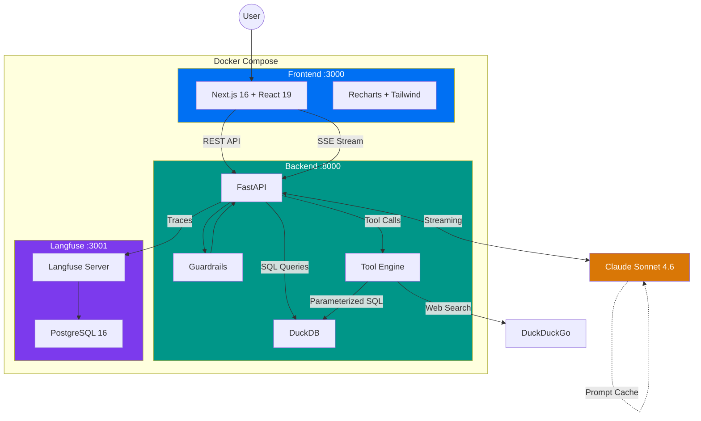
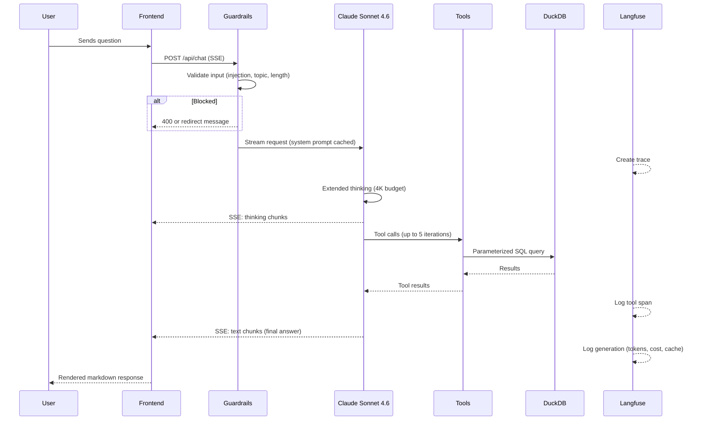

# Store Pulse - Rappi Store Availability Dashboard

Real-time analytics dashboard + AI-powered chatbot for monitoring Rappi store availability patterns, built with Next.js, FastAPI, DuckDB, and Claude.

**Stack:** Next.js 16 | FastAPI | DuckDB | Claude Sonnet 4.6 | Langfuse | Docker

---

## Overview

Store Pulse analyzes 67,141 observations of Rappi store visibility data (Feb 1-11, 2026, Colombia) and provides:

- **Interactive Dashboard** - KPI cards, time series, heatmaps, anomaly density charts, hourly distributions, and day-over-day comparisons
- **AI Chatbot** - Natural language interface powered by Claude with extended thinking, tool calling, and real-time streaming
- **Observability** - Self-hosted Langfuse for tracing every AI interaction: token usage, costs, tool calls, and latency

---

## Architecture



---

## AI Chatbot Flow

The chatbot uses Claude's native tool calling with extended thinking and prompt caching, streamed to the frontend via Server-Sent Events:



### Tool Calling Loop

Claude has access to 4 tools and can chain up to 5 iterations per request:

| Tool | Purpose | Security |
|------|---------|----------|
| `query_database` | Execute read-only SQL against DuckDB | SELECT-only + keyword blocklist + read-only DB |
| `analyze_anomaly` | Deep-dive into anomalies by date/hour | Parameterized queries |
| `compare_periods` | Compare two time periods statistically | Structured filter schema (no raw SQL) |
| `web_search` | Search for domain knowledge via DuckDuckGo | Input sanitized |

---

## Tech Stack

| Layer | Technology | Why |
|-------|-----------|-----|
| **Frontend** | Next.js 16, React 19, Tailwind, Recharts | Modern React with server components, fast charting |
| **Backend** | FastAPI, Python 3.12 | Async streaming, lightweight, great for APIs |
| **Database** | DuckDB | In-process analytics DB, zero config, blazing fast on columnar data |
| **AI** | Anthropic SDK (direct) | No LangChain abstraction - cleaner streaming, tool calling, and debugging |
| **Model** | Claude Sonnet 4.6 | Extended thinking + tool use + streaming |
| **Observability** | Langfuse (self-hosted) | Full tracing, token/cost tracking, no external dependencies |
| **Containers** | Docker Compose | One-command setup for all 4 services |

---

## Key Design Decisions

**Direct Anthropic SDK over LangChain** - The chatbot uses Claude's streaming API directly instead of wrapping it in LangChain/LangGraph. This gives full control over the SSE stream, thinking blocks, tool signatures, and prompt caching without abstraction overhead. The agentic tool-calling loop is a simple `while` loop with explicit message management.

**Prompt Caching** - The system prompt is cached across tool-calling iterations using Anthropic's ephemeral cache. In a multi-tool request, iteration 2+ reads ~600 tokens from cache at 90% discount instead of reprocessing them.

**Self-Hosted Langfuse** - Observability runs locally inside the Docker Compose stack with auto-seeded credentials. No external accounts needed. Every request is traced with token counts, costs, tool call latency, and cache hit rates.

**Custom Guardrails** - Input validation uses regex-based prompt injection detection and topic restriction instead of the `guardrails-ai` library (which requires a Hub token for validator installation). The guards fail-open to avoid blocking legitimate users.

**DuckDB over PostgreSQL** - The availability dataset is analytical (67K rows, read-only queries with aggregations, window functions, percentiles). DuckDB handles this in-process with zero configuration, while Postgres would add unnecessary operational complexity for a read-only workload.

---

## Quick Start

### Prerequisites

- Docker and Docker Compose
- An [Anthropic API key](https://console.anthropic.com/)

### Setup

```bash
# 1. Clone the repository
git clone https://github.com/jovalle02/RappiMakers.git
cd RappiMakers

# 2. Create your environment file
cp .env.example .env
# Edit .env and add your ANTHROPIC_API_KEY

# 3. Start all services
docker compose up --build
```

### Access

| Service | URL | Description |
|---------|-----|-------------|
| **Dashboard + Chat** | [http://localhost:3000](http://localhost:3000) | Main application |
| **Backend API** | [http://localhost:8000](http://localhost:8000) | FastAPI endpoints |
| **Langfuse** | [http://localhost:3001](http://localhost:3001) | Observability dashboard |

---

## Langfuse Dashboard

Langfuse is pre-configured with auto-seeded credentials. No registration needed.

**Login:** `admin@rappimakers.local` / `rappimakers`

Once logged in, you can explore:

- **Traces** - Every chat request with full breakdown (thinking, tool calls, response)
- **Generations** - Token usage per Claude API call, with input/output/cache breakdown
- **Cost** - Per-request and aggregate cost tracking (Claude Sonnet 4.6 pricing)
- **Latency** - End-to-end and per-tool response times

---

## Project Structure

```
RappiMakers/
├── backend/
│   ├── main.py              # FastAPI app + 7 REST endpoints
│   ├── chat.py              # SSE streaming chat with Claude (tool loop, caching)
│   ├── tools.py             # 4 tool definitions + safe execution
│   ├── prompts.py           # System prompt (data analyst persona + source attribution)
│   ├── database.py          # DuckDB initialization + parameterized query helper
│   ├── guards.py            # Input guardrails (injection, topic, length)
│   ├── observability.py     # Langfuse tracing helpers (traces, generations, spans)
│   ├── requirements.txt     # Python dependencies
│   └── Dockerfile
├── frontend/
│   ├── src/
│   │   ├── app/page.tsx     # Main page layout (dashboard + chat)
│   │   ├── components/
│   │   │   ├── chat/        # AI chatbot panel with SSE streaming
│   │   │   ├── dashboard/   # 6 chart components (timeline, heatmap, etc.)
│   │   │   └── ui/          # Shared UI components (shadcn/ui)
│   │   └── lib/api.ts       # API client + TypeScript interfaces
│   ├── package.json
│   └── Dockerfile
├── processing_data/
│   ├── data/
│   │   └── availability.csv # Processed dataset (67,141 rows)
│   └── Archivo/             # Raw source CSV files
├── transform_data.py        # Data processing pipeline
├── docker-compose.yml       # 4 services: frontend, backend, langfuse, postgres
├── .env.example             # Environment variable template
└── README.md
```

---

## API Endpoints

| Method | Endpoint | Description |
|--------|----------|-------------|
| `GET` | `/api/stats` | Overall KPI statistics (peak, avg, min, anomaly count, uptime) |
| `GET` | `/api/data` | Time series data with optional filtering and downsampling |
| `GET` | `/api/heatmap` | Average store count by hour and day of week |
| `GET` | `/api/daily-comparison` | Daily curves using daily percentage for comparison |
| `GET` | `/api/anomalies` | All flagged anomaly points (z-score > 2) |
| `GET` | `/api/anomaly-density` | Anomaly count and rate by hour of day |
| `GET` | `/api/hourly-stats` | Store count distribution per hour (avg, min, max, percentiles) |
| `POST` | `/api/chat` | AI chatbot endpoint (SSE streaming response) |

---

## Dataset

67,141 observations of visible Rappi store counts, recorded every 10 seconds from February 1-11, 2026 in Colombia.

| Column | Type | Description |
|--------|------|-------------|
| `timestamp` | TIMESTAMP | Precise observation timestamp |
| `store_count` | INT | Number of visible stores (range: 37 - 39,000) |
| `rolling_avg_30m` | FLOAT | 30-minute rolling average |
| `daily_pct` | FLOAT | Store count as % of that day's peak (0-100%) |
| `z_score` | FLOAT | Statistical deviation from hourly mean |
| `is_anomaly` | BOOL | Flagged when \|z_score\| > 2 |
| `hour`, `minute`, `day_of_week`, `day_num` | Various | Time decomposition fields |
